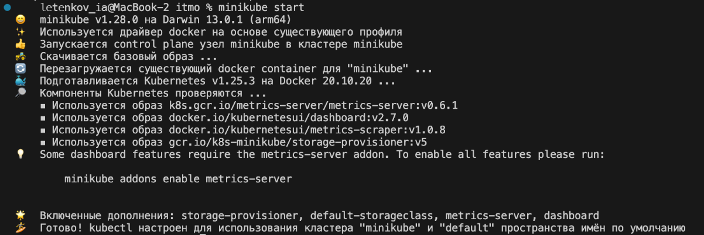
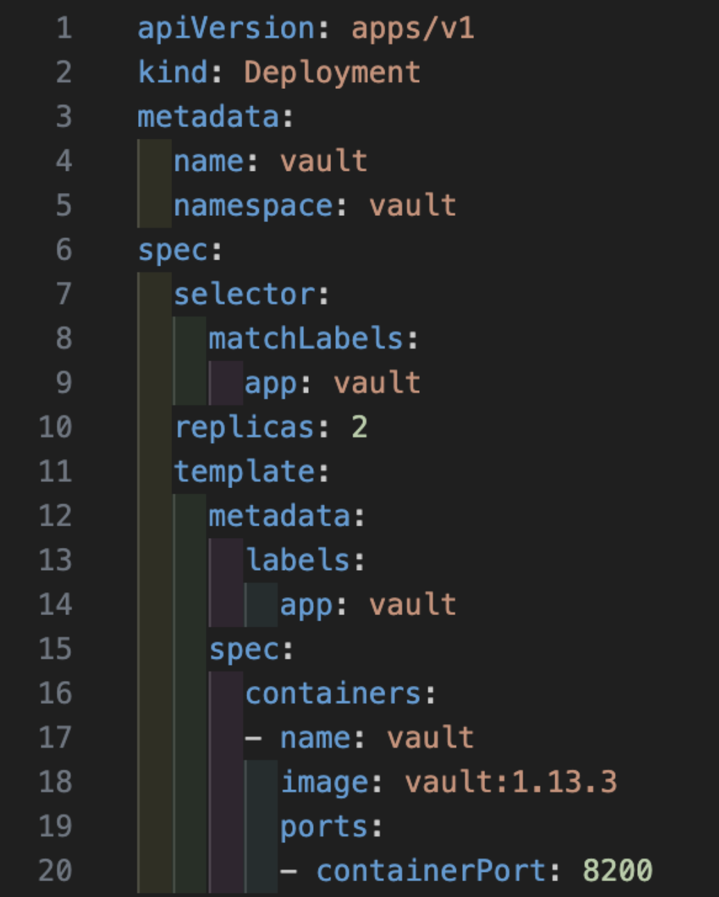
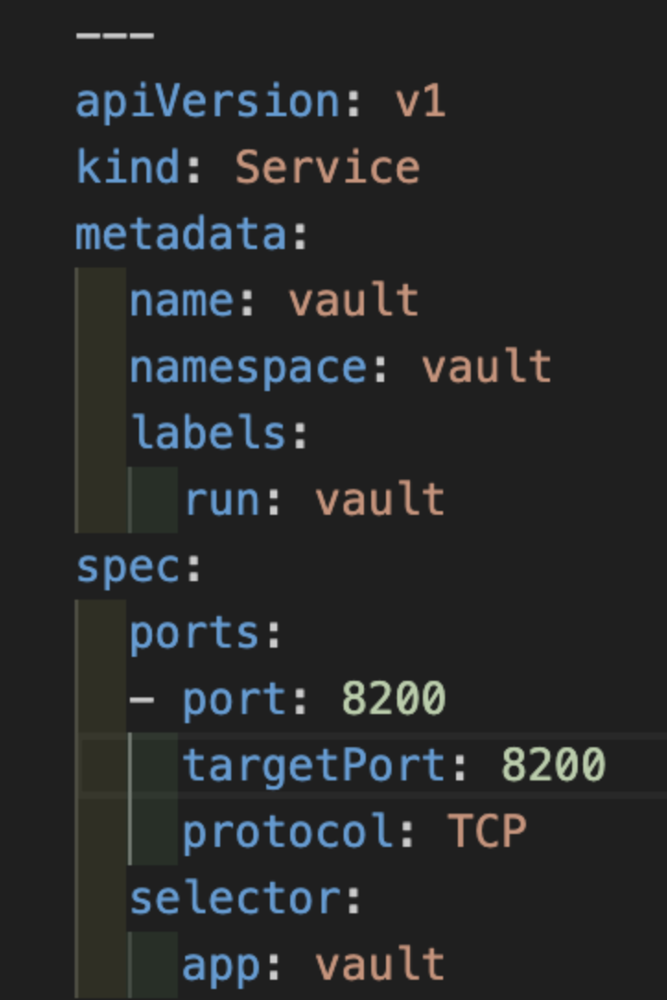
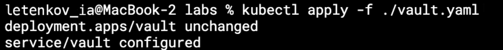
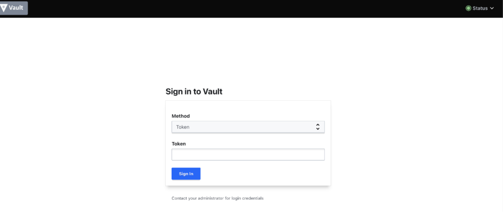
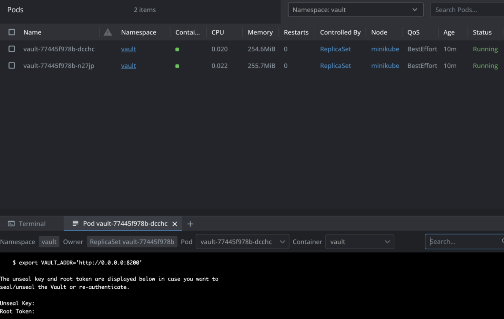
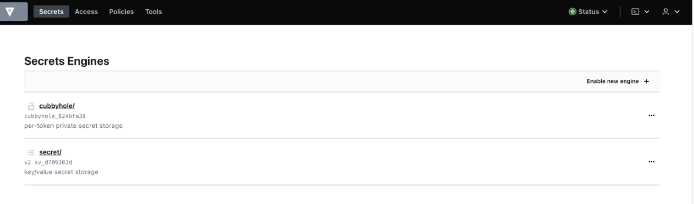
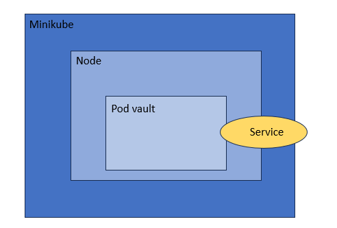

University: [ITMO University](https://itmo.ru/ru/)  
Faculty: [FICT](https://fict.itmo.ru)  
Course: [Introduction to distributed technologies](https://github.com/itmo-ict-faculty/introduction-to-distributed-technologies)  
Year: 2023/2024  
Group: K4112c  
Author: Letenkov Ilya Alekseevich
Lab: Lab1  
Date of create: 15.11.2023  
Date of finished:  

1. Был запущен minikube.  

2. Содзан манифест создания пода.  

3. Разворачиваем его в кластере.  

4. Создаём сервис.

5. Деплоим сервис.  

6. Прокидываем порт и волт открывается в браузере.  

7. Для получения токена открываем логи пода.  

8. Вошли в волт.  

Схема  

Выводы: В ходе выполнения лабораторной работы в контейнере докер был запущен кластер kubernetes, состоящий из одной ноды. Были освоены такие понятия, как кластер, нода, под и сервис. Также был написан манифест для создания пода и сервис, позволяющий получить к поду доступ с локальной машины.
