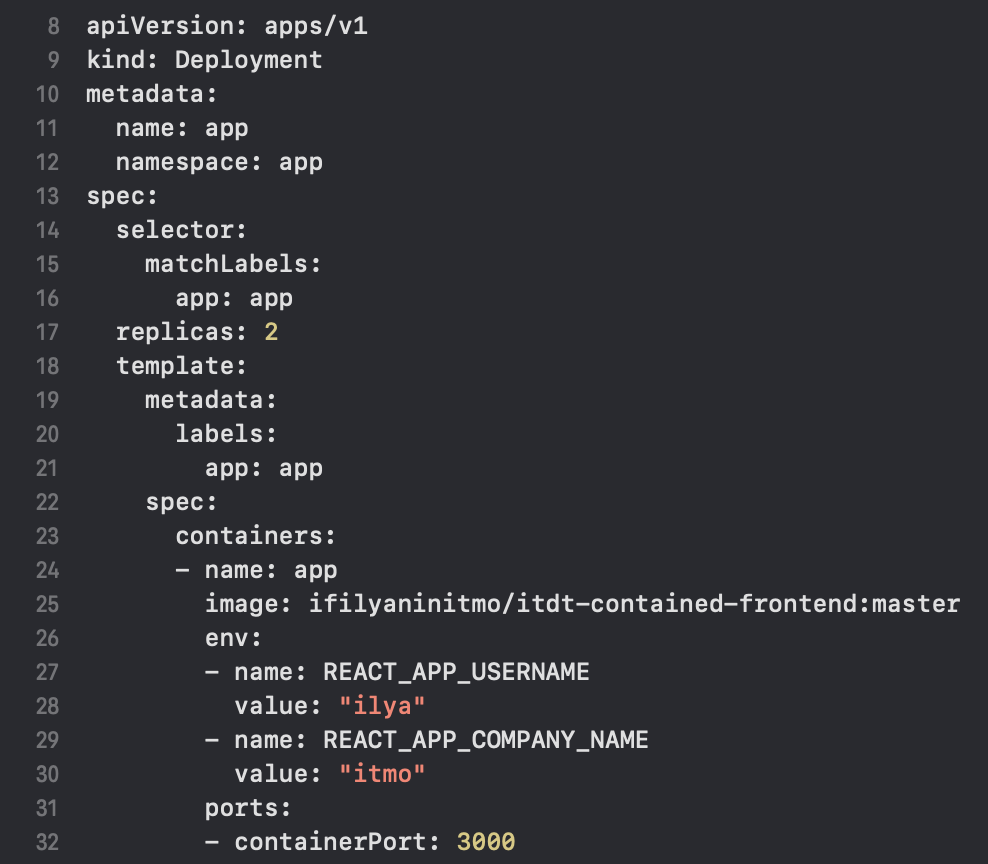
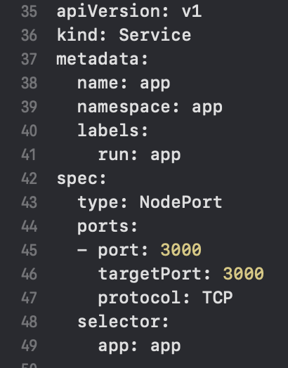
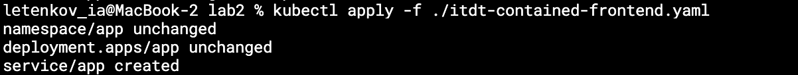
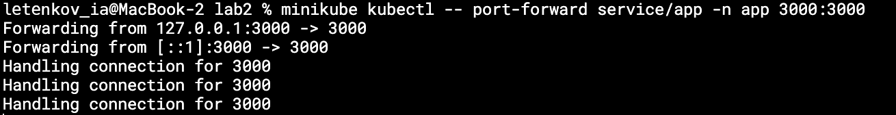
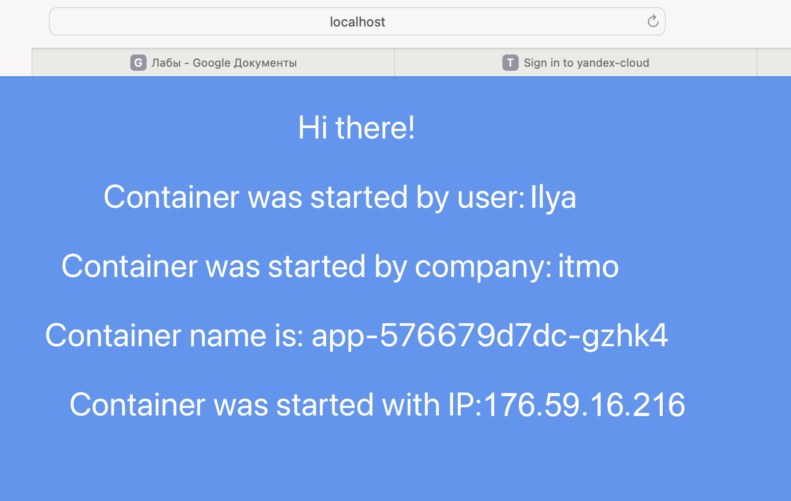
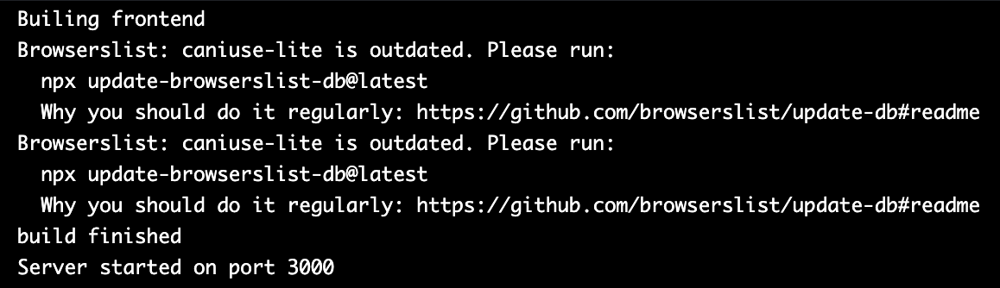
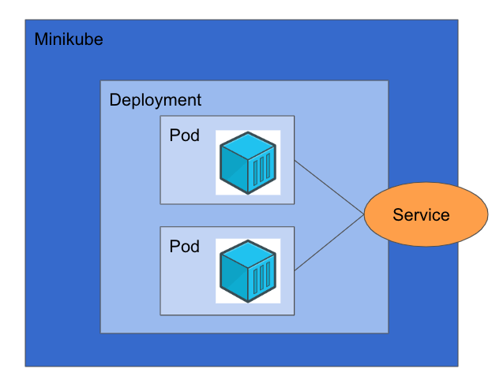

University: ITMO University
Faculty: FICT
Course: Introduction to distributed technologies
Year: 2023/2024
Group: K4112c
Author: Letenkov Ilya Alekseevich 
Lab: Lab1
Date of create: 17.11.2023
Date of finished:

1. Создаём файл деплоймента.  

2. Создём манифест сервиса для доступа к подам.

3. Деплоим выше описанные файлы.  

4. Прокидываем порт. Приложение открывается в браузере.  

5. Приложение работает. Значения переменных соответствуют тем, которые были переданы в коде. Также указано название пода и айпи - оно может меняться в завимости от того, в какой под идёт запрос. У нас две реплики, в браузере отображается информация одной из них.

6. Проверены логи контейнеров. 

Схема  

Вывод: В результате выаолнения лаборатнорной работы в ранее созданном кластере Minikube было развернуто два пода с помощью deployment, после чего к ним был предоставлен доступ через сервис. Также в ходе работы были изучены принципы работы Depolyment и ReplicaSet, а также принципы распределения трафика между контейнерами.
