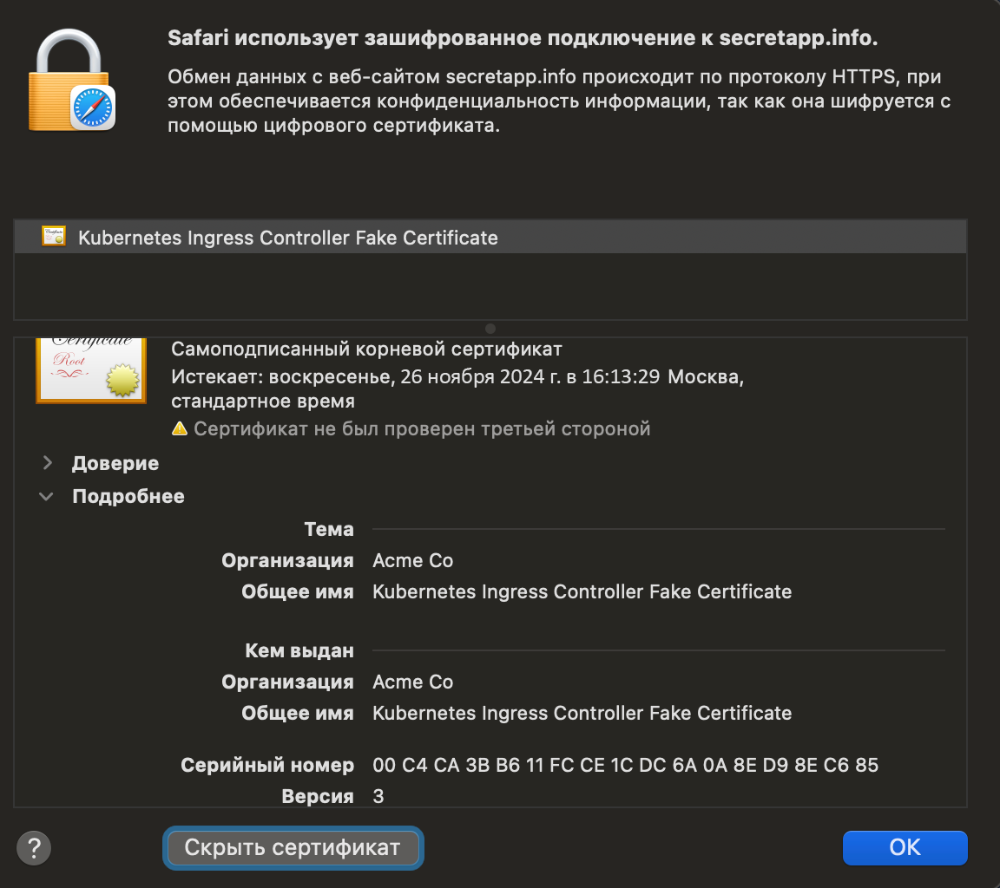

University: [ITMO University](https://itmo.ru/ru/)  
Faculty: [FICT](https://fict.itmo.ru)  
Course: [Introduction to distributed technologies](https://github.com/itmo-ict-faculty/introduction-to-distributed-technologies)  
Year: 2023/2024  
Group: K4112c  
Author: Letenkov Ilya Alekseevich
Lab: Lab3  
Date of create: 26.11.2023  
Date of finished:  

1. Создём шаблон configMap с необходимыми переменными.  

   
2. Создаём ReplicaSet, в который передаём указанные переменные.  

3. Создаём tls секрет, в который прописываем созданные приватный и публичный ключ. 

   
4. Создаём сервис для приложения.  

5. Создаём ингресс. В него подтягиваем ключи из секрета, созданного ранее, а также указываем путь, по которому будет доступно наше приложение.  

   
6. Деплоим всё вышеуказанное.  

7. Далее достаточно запустить minikube addons enable ingress, а также minikube tunnel. 

   
8. Переходим в браузер.

9. Сертификат.  

Схема  

Вывод: В результате выполнения лабораторной работы был настроен веб-сайт, данные которого хранятся в кластере minikube, а доступ осуществляется по доменному имени. Были освоены основы работы с ingress, сертификатами и секретами.
