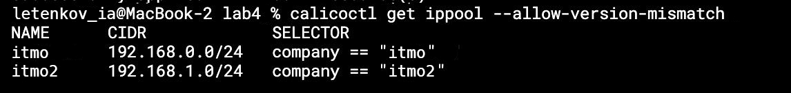

University: [ITMO University](https://itmo.ru/ru/)  
Faculty: [FICT](https://fict.itmo.ru)  
Course: [Introduction to distributed technologies](https://github.com/itmo-ict-faculty/introduction-to-distributed-technologies)  
Year: 2023/2024  
Group: K4112c  
Author: Letenkov Ilya Alekseevich
Lab: Lab4  
Date of create: 27.11.2023  
Date of finished:  

1. Проверяем наличие подов калико.  
     

2. Проверяем наличие двух разных нод.  
   

3. Ставим нодам лейблы.  

4. Удаляем существующий дефолтный ippool, проверяем, что больше никаких не осталось.  

5. Проверяем, что наши ippool создались и с ними всё верно.  

6. Разорачиваем приложение с сервисом. Проверяем, какие айпи адреса были ему назначены. Адреса из тех ippool которые мы создавали, следовательно, всё настроено верно.  

7. Подключаемся к одному из подов, пингуем соседний. Пинг идёт, связь между ними есть.  

8. Пробрасываем порты сервиса, открываем приложение в браузере. Всё отображается корректно.  

Схема  

